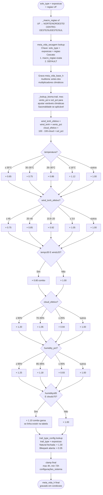
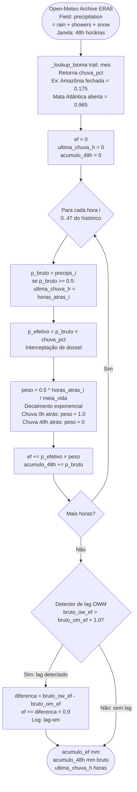
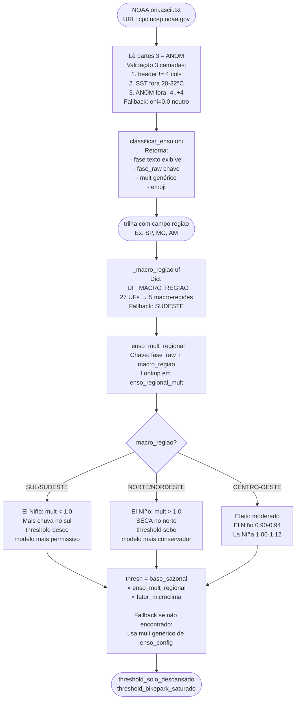
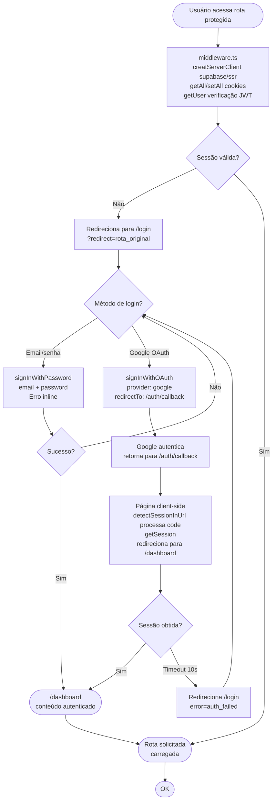
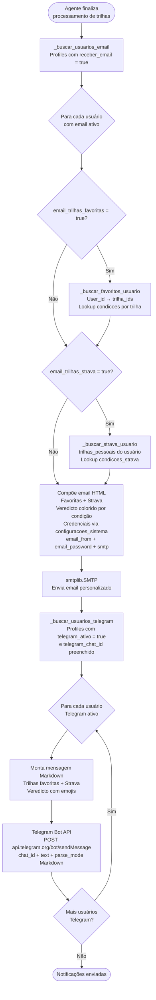
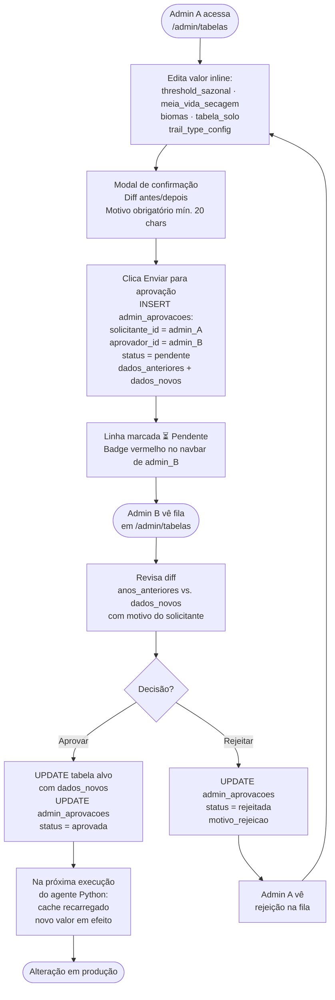
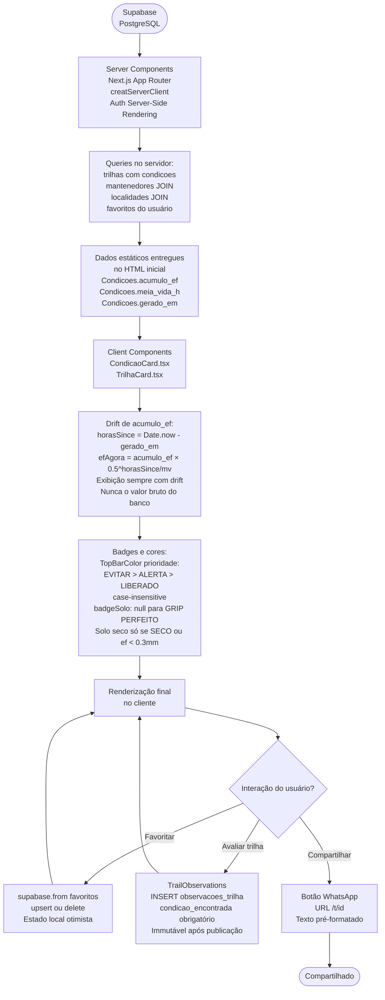

# MTB Forecast — Diagramas de Fluxo do Sistema

> Diagramas Mermaid e ASCII cobrindo todos os fluxos operacionais do MTB Forecaster.
> Atualizado em jun/2026 com: batch OM, modelo regional, mantenedores, remoção do timemachine.

---

## 1. Arquitetura geral do sistema

```
┌───────────────────────────────────────────────────────────────────────────┐
│                          FONTES EXTERNAS                                   │
│                                                                             │
│  ┌─────────────────────┐  ┌──────────────────────────┐  ┌──────────────┐ │
│  │  OpenWeather         │  │  Open-Meteo               │  │  NOAA CPC    │ │
│  │  · One Call 3.0      │  │  · Forecast (batch)       │  │  · ONI ENSO  │ │
│  │    forecast          │  │  · Archive ERA5 (batch)   │  └──────────────┘ │
│  │  · Day Summary       │  │    multi-coord            │                   │
│  │    hoje+ontem        │  └──────────────────────────┘  ┌──────────────┐ │
│  └─────────────────────┘                                  │  Anthropic   │ │
│                                                           │  Claude AI   │ │
└────────────────────────────────────┬──────────────────────┴──────────────┘ │
                                     │                        └──────────────┘
                                     ▼
┌───────────────────────────────────────────────────────────────────────────┐
│                  AGENTE PYTHON (GitHub Actions)                            │
│                                                                             │
│  Schedule: Seg–Qui 07h · Sex/Sáb 07h/13h/21h · Dom 07h/13h (BRT)         │
│                                                                             │
│  1. Carrega 16+ tabelas de config do Supabase                              │
│  2. Busca ONI NOAA → classifica ENSO + fase_raw                           │
│  3. Batch OM forecast + histórico (2 chamadas totais)                      │
│  4. Para cada trilha: pipeline de solo + veredicto                         │
│  5. Grava condicoes (DELETE + INSERT)                                      │
│  6. Processa pump tracks (só previsão)                                     │
│  7. Envia notificações (email + Telegram)                                  │
└────────────────────────────────────┬──────────────────────────────────────┘
                                     │
                                     ▼
┌───────────────────────────────────────────────────────────────────────────┐
│                   SUPABASE (PostgreSQL + Auth + Storage + RLS)             │
│                                                                             │
│  DADOS OPERACIONAIS                                                         │
│  trilhas · condicoes · condicoes_strava · mantenedores                     │
│  favoritos · profiles · trilhas_pessoais                                    │
│  observacoes_trilha · admin_aprovacoes                                     │
│                                                                             │
│  PUMP TRACKS                                                                │
│  trilhas_pumptrack · condicoes_pumptrack                                   │
│                                                                             │
│  TABELAS DE CONFIG DO MODELO (16+)                                          │
│  meia_vida_secagem (+ regiao) · enso_regional_mult (NOVA)                 │
│  threshold_sazonal (+ macro-regiões) · meia_vida_clima_mult               │
│  biomas · trail_type_config · aderencia_thresholds                        │
│  veredicto_pesos · veredicto_limiares · ... (mais 7)                      │
│                                                                             │
│  STORAGE: logos · avatars · pumptrack-photos                               │
└────────────────────────────────────┬──────────────────────────────────────┘
                                     │
                                     ▼
┌───────────────────────────────────────────────────────────────────────────┐
│                    WEB APP (Next.js 14 App Router / Vercel)                │
│                                                                             │
│  Server Components leem Supabase diretamente                               │
│  Client Components recalculam drift de acumulo_ef localmente               │
│                                                                             │
│  / · /login · /cadastro · /dashboard · /trilhas · /trilhas/[id]           │
│  /mantenedores/[id] · /pump-track/[id] · /mapa · /t/[id]                 │
│  /perfil · /perfil/strava · /admin · /admin/tabelas · /planos             │
└───────────────────────────────────────────────────────────────────────────┘
```

---

## 2. Fluxo de execução do agente Python

```mermaid
flowchart TD
    START([GitHub Actions trigger\nschedule ou dispatch]) --> ENV

    ENV[_validar_env\nVerifica OPENWEATHER_API_KEY\n+ SUPABASE_SERVICE_KEY] --> TABLES

    TABLES[Carregamento de tabelas de config\n16+ caches globais via Supabase REST\nSe cache existir: reutiliza] --> ONI

    ONI[fetch_oni_atual\nNOAA oni.ascii.txt\nLê ANOM partes 3\nValidação 3 camadas\nRetorna: fase_raw, mult, emoji] --> TRILHAS

    TRILHAS[_carregar_trilhas_supabase\naprovada = true\nJOIN localidades\nJOIN mantenedores\nFallback: trilhas.csv] --> BATCH

    BATCH[fetch_batch_openmeteo\nForecast: 1 chamada\nHistórico ERA5: 1 chamada\nMulti-coord: lat=a,b,c&lon=x,y,z\nCobre todos os 23 grupos] --> LOOP

    LOOP{Para cada trilha} --> PIPELINE

    PIPELINE[processar_trilha\nVer fluxo 3] --> OVERRIDE

    OVERRIDE[_aplicar_override_chuva_futura\nSe bloco 0 ou 1 > 3mm:\nSECO/GRIP → BOA + ALERTA] --> OBS

    OBS[ajustar_por_observacoes\nConsulta observacoes_trilha\núltimas 24h\ndelta risco cap +2] --> GRAVAR

    GRAVAR[gravar_supabase\nDELETE + INSERT condicoes\n~45 campos incluindo\ncloud_pct, humidity_pct\ntemp_media_c, meia_vida_base_h] --> MAIS

    MAIS{Mais trilhas?} -->|Sim| LOOP
    MAIS -->|Não| STRAVA

    STRAVA[processar_segmentos_strava\nMesmo pipeline\nDELETE + INSERT condicoes_strava] --> PUMPS

    PUMPS[_processar_pumptracks\nSó previsão, sem solo\nDELETE + INSERT condicoes_pumptrack] --> NOTIF

    NOTIF[Notificações\nEmail: profiles com receber_email=true\nTelegram: profiles com telegram_ativo=true] --> LOG

    LOG[Log + Artifact\ndebug_YYYY-MM-DD.log\nUpload GitHub Actions 30 dias] --> END([Fim])
```



---

## 3. Pipeline por trilha (`processar_trilha`)

```mermaid
flowchart TD
    TRAIL([Trilha recebida]) --> SOLO

    SOLO[_lookup_solo\nsolo_type + bioma + regiao\nCascata: exact → bioma → global\nRetorna: clay_pct, sand_pct, texture_class] --> OWM

    OWM[fetch_onecall OWM\nPrevisão horária 48h\npeso 70%\nrain, wind, pop, pico_3h, gust] --> OMFORECAST

    OMFORECAST[fetch_openmeteo batch\nPrevisão futura\npeso 30%\nFusão 70/30 nos campos] --> DAYSUM

    DAYSUM[fetch_onecall_day_summary OWM\nPrecipitação hoje + ontem\nDetector de lag OM:\nse bruto_ow > bruto_om + 1.0mm\n→ adiciona diferença × 0.9 ao ef] --> OMHIST

    OMHIST[fetch_batch_openmeteo_historico\nERA5 últimas 48h\nPrecipitação: campo precipitation\nTemp, vento, nuvens, umidade\nGrava cloud_pct, humidity_pct\ntemp_media_c para auditoria] --> VENTO

    VENTO[fetch_vento_historico\nERA5 wind + gusts\nNível 1/2/3\n55/65/90 km/h] --> ENSO

    ENSO[_enso_mult_regional\nenso fase_raw + macro_regiao\nNORTE/NORDESTE: lógica inversa\nFallback: enso_config genérico] --> ACUMULO

    ACUMULO[calcular_acumulo_ef\nΣ p_i × chuva_pct × 0.5^t_i/τ\nchuva_pct de _lookup_bioma\nτ = meia_vida calculada\nCampo canonical: precipitation] --> MEIAVIDA

    MEIAVIDA[_meia_vida + _ajustar\nBase: meia_vida_secagem regiao\n× clima temperatura, vento, nuvens, umidade\n× combo garoa se humidity≥85 E cloud≥70\n× trail_type_config\nClamp 4h–72h\nGrava meia_vida_base_h para auditoria] --> ADERENCIA

    ADERENCIA[calcular_aderencia\nefetivo_threshold = ef+pico3h / fator_mc\nLookup aderencia_thresholds\nFator de recuperação × 2.5\nRegras bikepark] --> FUTURA

    FUTURA[calcular_aderencia_futura_oc\nPior bloco 6h em 24h\nstatus + label + rain] --> VEREDICTO

    VEREDICTO[veredicto\nSistema de pontuação de risco\nPesos: aderencia+pico+vento\n+inclinacao+hist+rajada+futuro\nLimiares: 0-1/2-3/4+] --> JANELA

    JANELA[calcular_janela_oc\nMaior bloco limpo 48h\npop<30% + rain<1mm + wind<15ms] --> CLAUDE

    CLAUDE[Claude AI\nfrase_secagem contextualizada\npor região + ENSO + condição] --> RESULTADO([resultado dict\npronto para gravar])
```



---

## 4. Pipeline de cálculo de meia-vida



---

## 5. Cálculo de veredicto

```mermaid
flowchart TD
    INPUTS([aderencia_status\npico_3h, rain_mm\nwind_ms, gust_max_kmh\ninclinacao, trail_type\nalerta_vento_nivel\naderencia_futura]) --> RISCO0

    RISCO0[risco = 0] --> ADH

    ADH{aderencia_status} -->|BAIXA| A3[risco += 3]
    ADH -->|BOA| A2[risco += 2]
    ADH -->|GRIP| A1[risco += 1]
    ADH -->|SECO| A0[risco += 0]
    A3 & A2 & A1 & A0 --> PICO

    PICO{pico_3h?} -->|≥ 15mm| P2[risco += 2]
    PICO -->|≥ 10mm| P1[risco += 1]
    PICO -->|< 10mm| P0[sem adição]
    P2 & P1 & P0 --> RAIN

    RAIN{rain_mm ≥ 8?} -->|Sim| R1[risco += 1]
    RAIN -->|Não| R0[sem adição]
    R1 & R0 --> WIND

    WIND{wind_ms ≥ 12?} -->|Sim| W1[risco += 1]
    WIND -->|Não| W0[sem adição]
    W1 & W0 --> INCLINA

    INCLINA{inclinacao\ncom umidade?} -->|> 30%| I2[risco += 2]
    INCLINA -->|> 20%| I1[risco += 1]
    INCLINA -->|outros| I0[sem adição]
    I2 & I1 & I0 --> TIPO

    TIPO{trail_type} -->|bikepark normal| BK1[risco -= 1]
    TIPO -->|bikepark saturado| BK2[risco -= 1\nrisco += 2]
    TIPO -->|natural inclinada\n+ rain + BOA/BAIXA| NT1[risco += 1]
    TIPO -->|outros| BK0[sem adição]
    BK1 & BK2 & NT1 & BK0 --> HISTV

    HISTV{alerta_vento_nivel?} -->|3 > 90 km/h| HV3[risco += 2]
    HISTV -->|2 65-90| HV2[risco += 1\nse encharcado: +1]
    HISTV -->|1 + encharcado| HV1[risco += 1]
    HISTV -->|0| HV0[sem adição]
    HV3 & HV2 & HV1 & HV0 --> RAJADA

    RAJADA{gust_max_kmh?} -->|≥30 aberta\nou ≥50 fechada| RAJ[risco = max risco, 2]
    RAJADA -->|outros| RAJ0[sem adição]
    RAJ & RAJ0 --> FUTURO

    FUTURO{aderencia_futura\nvs. atual?} -->|piora severa BAIXA| FU2[risco += 2]
    FUTURO -->|piora moderada BOA| FU1[risco += 1]
    FUTURO -->|melhora| FM1[risco -= 1]
    FUTURO -->|estável| FU0[sem adição]
    FU2 & FU1 & FM1 & FU0 --> LIMIAR

    LIMIAR{risco total?} -->|0–1| LIBERA[DROP LIBERADO]
    LIMIAR -->|2–3| ALERTA[DROP LIBERADO\nVeja os alertas]
    LIMIAR -->|≥ 4| ESPERA[MELHOR ESPERAR]

    LIBERA & ALERTA & ESPERA --> POSTP

    POSTP[Pós-processadores\n1. _aplicar_override_chuva_futura\n2. ajustar_por_observacoes] --> FINAL([veredicto final])
```



---

## 6. Cálculo de `acumulo_ef`



---

## 7. Fluxo ENSO regional



---

## 8. Fluxo de autenticação do Web App



---

## 9. Fluxo de integração Strava

```mermaid
flowchart TD
    RIDER([Rider em /perfil\nclica Conectar com Strava]) --> AUTH

    AUTH[GET /api/strava/auth\nMonta redirect_uri dinâmico\nx-forwarded-host ou host\nRedireciona para strava.com/oauth/authorize] --> STRAVA

    STRAVA[Strava: rider autoriza\nescopo: read + activity:read] --> CB

    CB[GET /api/strava/callback?code=...\n1. POST /oauth/token → access_token\n2. GET /segments/starred?per_page=50] --> FILTER

    FILTER[Filtra segmentos:\nkom_rank != null OU distance > 500m\nLimita a 15\nSet-Cookie strava_token httpOnly 1h] --> PERFIL

    PERFIL[Redireciona\n/perfil/strava?segments=JSON] --> CONFIG

    CONFIG[Rider configura cada segmento:\nsolo_type · exposicao\ntrail_type · bioma] --> SAVE

    SAVE[INSERT trilhas_pessoais\nstrava_segment_id, name, lat, lon\ndistance, desnivel, altitude\nsolo_type, exposicao, trail_type, bioma\npolyline, strava_elevation_profile] --> AGENT

    AGENT[Agente Python\nbuscar_segmentos_strava_unicos\nProcessa mesmo pipeline de trilha\nGrava condicoes_strava\nDELETE + INSERT por strava_segment_id] --> DASH

    DASH[/dashboard\nMostrar trilhas Strava\nborda laranja FC4C02] --> END([Notificações\npor email/Telegram])

    DESCON([Rider clica Desconectar]) --> DSCB

    DSCB[POST /api/strava/disconnect\nRemove cookies\nstrava_access_token\nstrava_refresh_token] --> PERFIL2

    PERFIL2[/perfil sem Strava\nBotão Conectar] --> AUTH
```

---

## 10. Fluxo de notificações ao usuário



---

## 11. Fluxo de aprovação dual-admin (tabelas mestras)



---

## 12. Fluxo de aprovação de trilha

```mermaid
flowchart TD
    RIDER([Rider autenticado\nem /trilhas/cadastrar]) --> FORM

    FORM[Preenche formulário:\nnome, lat/lon, solo_type, exposicao\ntrail_type, bioma, altitude\ndesnivel, extensao, ref_url] --> GEO

    GEO[extrairCoordenadas\nURL Google Maps → lat/lon\nFallback: input manual] --> INSERT

    INSERT[INSERT trilhas_pendentes\nstatus = pendente\nuser_id = rider] --> PERFIL

    PERFIL[/perfil exibe\ntrilha com badge pendente] --> ADMIN

    ADMIN([Admin acessa /admin\nVê contador trilhas pendentes]) --> REVIEW

    REVIEW[AdminPanel\nGrid 9 campos da trilha\nLink Google Maps satélite] --> DECIDE

    DECIDE{Decisão?} -->|Aprovar| NOMINATIM
    DECIDE -->|Rejeitar| REJECT

    NOMINATIM[Nominatim geocoding\nlat/lon → cidade, estado\nISO3166-2-lvl4 para sigla UF] --> GEOOK

    GEOOK{Geocoding OK?} -->|Sim| LOCAL_SAVE
    GEOOK -->|Falha| LOCAL_MIN

    LOCAL_SAVE[INSERT localidades\nestado, cidade, localidade\nOu lookup se já existe] --> TRILHA_INSERT

    LOCAL_MIN[INSERT localidades mínima\nestado = trilha.regiao\ncidade = vazio\nGarante localidade_id não nulo] --> TRILHA_INSERT

    TRILHA_INSERT[INSERT trilhas\naprovada = true\nlocalidade_id preenchido\nUPDATE trilhas_pendentes\nstatus = aprovada] --> VISIVEL

    VISIVEL[Trilha aparece em /trilhas\nAgente processa na próxima execução] --> END_OK([OK])

    REJECT[Modal: motivo obrigatório\nUPDATE trilhas_pendentes\nstatus = rejeitada\nmotivo_rejeicao] --> RIDER_NOTIF

    RIDER_NOTIF[Rider vê motivo\nem /perfil] --> END_REJ([Rejeição notificada])
```

---

## 13. Fluxo de dados do frontend



---

## 14. Fluxo de ativação Telegram

```
Rider em /perfil
      │
      ▼
Vê: "Notificações por Telegram"
Instrução: acesse o bot @mtb_forecaster_bot e envie /start
      │
      ▼
Rider envia /start no Telegram
      │
      ▼
POST /api/telegram/webhook
  │
  ├─ Recebe payload: {"message": {"chat": {"id": 123456789}, "text": "/start"}}
  │
  ├─ supabase.from('profiles')
  │    .update({ telegram_chat_id: chat_id, telegram_ativo: true })
  │    .eq('telegram_username', username)
  │
  └─ Responde: "Notificações ativas! Você receberá atualizações..."
      │
      ▼
Próxima execução do agente:
  _buscar_usuarios_telegram() → profile com telegram_ativo = true
  Para cada trilha favorita do usuário:
    monta mensagem Markdown com veredicto
  Telegram Bot API → sendMessage(chat_id, texto)
```

---

## 15. Fluxo de upload de logo de mantenedor

```
Admin acessa cadastro/edição de mantenedor
      │
      ▼
Seleciona arquivo de imagem (jpeg/png/webp)
      │
      ▼
Frontend — compressão via canvas:
  canvas.drawImage(img)
  canvas.toBlob('image/webp', 0.85)
  FormData com Blob WebP
      │
      ▼
POST /api/admin/upload-logo
  ├─ Valida tipo e tamanho
  ├─ Supabase Storage: upload para bucket 'logos'
  │    Path: mantenedores/{mantenedor_id}/{timestamp}.webp
  └─ Retorna logo_url pública
      │
      ▼
Admin confirma logo no preview ao vivo
      │
      ▼
UPDATE mantenedores SET logo_url = url
      │
      ▼
LogoMantenedor component exibe com  nativo
(NÃO next/image — domínio Supabase fora de remotePatterns)
```

---

## 16. Fluxo de ativação de mantenedor em trilha

```
                    /trilhas?estado=SP
                          │
          ┌───────────────┴──────────────────┐
          ▼                                   ▼
  Trilha sem mantenedor_id           Trilha com mantenedor_id
          │                                   │
  TrilhaCard normal                  TrilhaCard com LogoMantenedor
  sem pill/logo                      pill escuro #1e2018
                                     nome_primario + nome_secundario
                                     cores dinâmicas
                                              │
                                    Select "Mantenedores / Bike Park"
                                              │
                                              ▼
                                  Navega para /mantenedores/[id]
                                              │
                                              ▼
                                  Hero: logo (se preenchido) + nome
                                  com link ↗ site_url
                                              │
                                              ▼
                                  Grid de todas as TrilhaCards
                                  do mantenedor com condição atual
```
